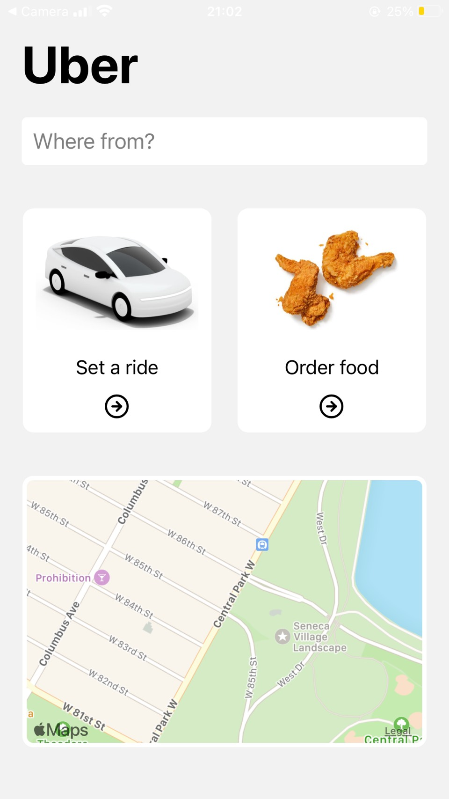
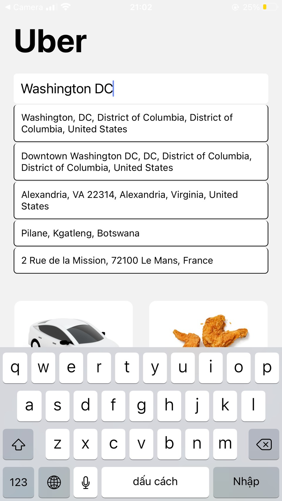
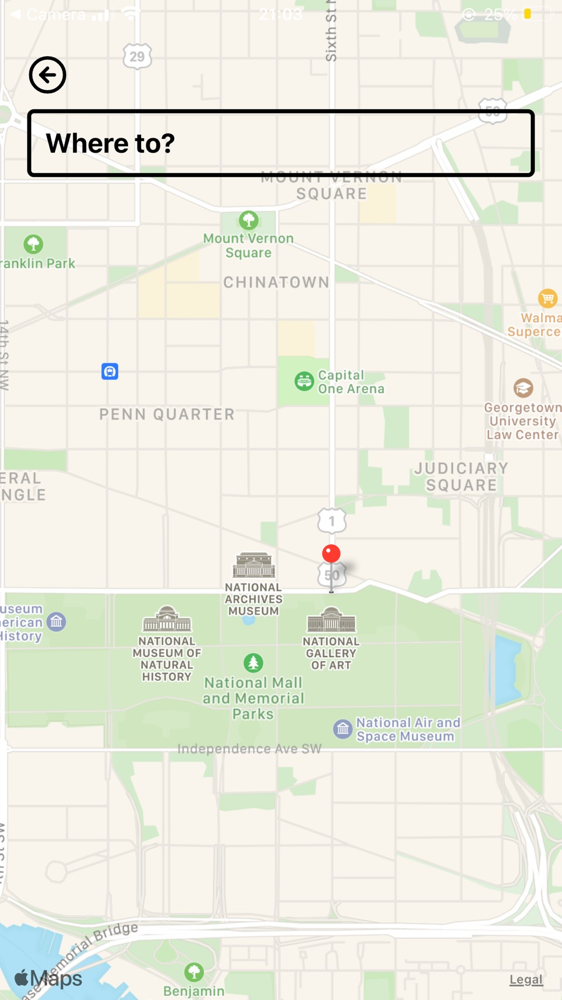
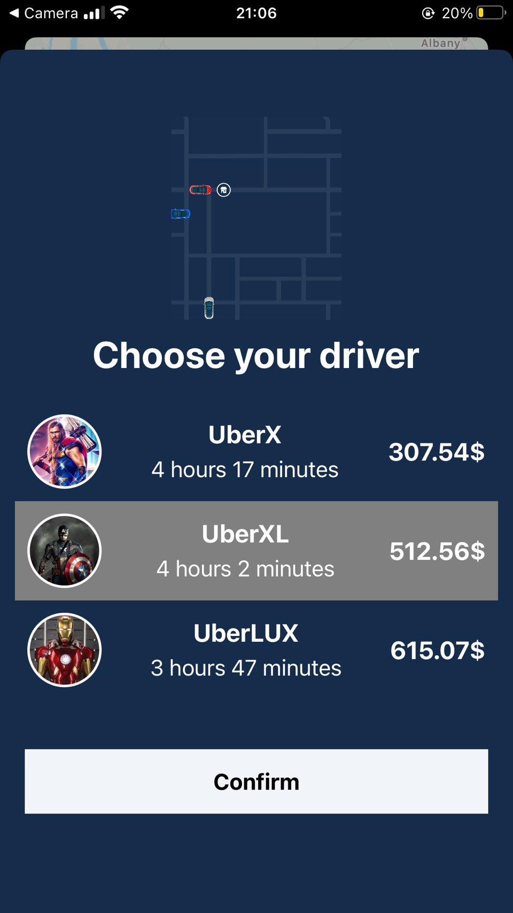

# Uber-mobile-app
This react native mobile app just focuses on front-end side rendering and no back-end integration. Using typescript and tomtom API to develop, so it is a a lot simple
compared to the actual uber app. Also, the UI and animation is funny to watch :laughing: :laughing: :laughing:

> 

 &nbsp;  &nbsp; 
    &nbsp; 

> 

### Stack I use to develop the app:
- React native with Typescript
- Redux
- Tailwind CSS (using native-wind library)
- React native reanimated 2 (to do some animation stuffs)
- React native maps (to render IOS map)
- Tomtom API services (including places API, directions API)

>

### APP features and upcoming updates:
- Full map rendering with the ability to search places around the world, autocomplete && direction features
- Aiming to add new features like geocoding (coordinates for an address), traffic API (from tomtom service) and the ability to switch between vehicles (to render direction for each type of vehicle and also based on the traffic to render the fastest route)
